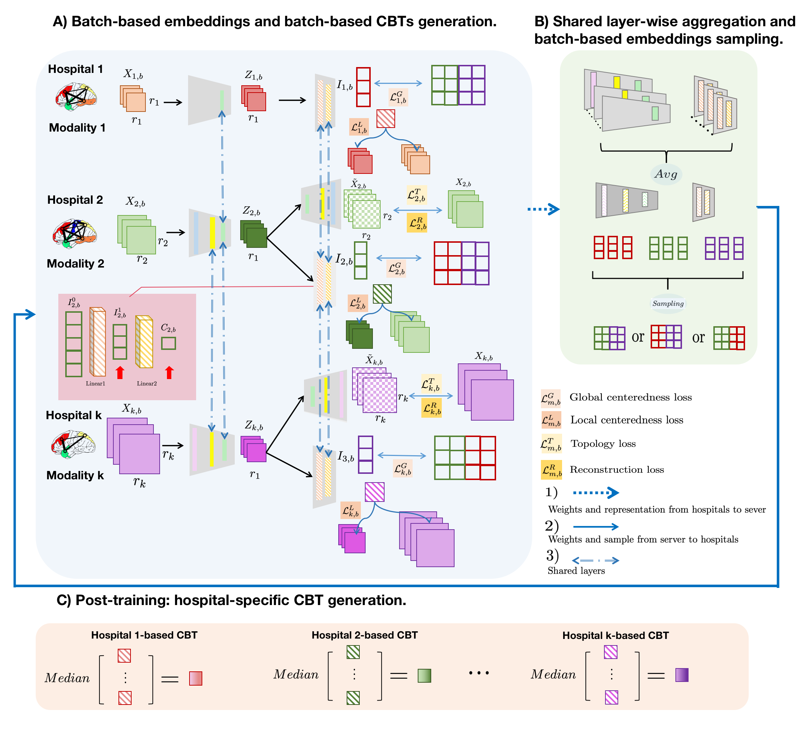
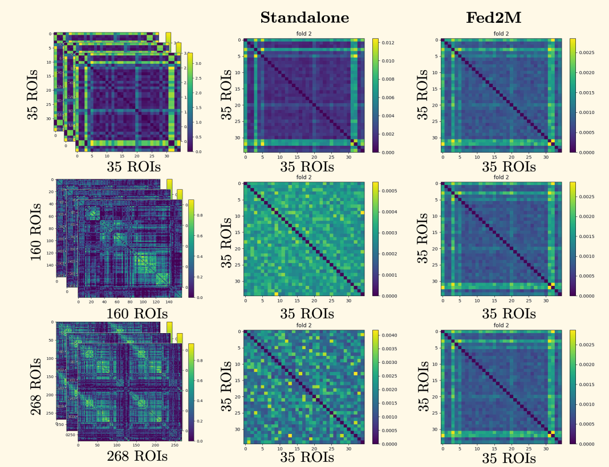

# Federated Multimodal and Multiresolution Graph Integrator (Fed2M)
Please contact jiajia010616@gmail.com for inquiries. Thanks. 

# Introduction
This work is accepted at the DGM4MICCAI workshop 2023.



>**Federated Multimodal and Multiresolution Graph Integration for Connectional Brain Template Learning**
>
> Jia Ji and Islem Rekik
>
> BASIRA Lab, Imperial-X and Department of Computing, Imperial College London, London, UK
>
 **Abstract:** *The connectional brain template (CBT) is an integrated graph that normalizes brain connectomes across individuals in a given population. A \emph{well-centered} and \emph{representative} CBT can offer a holistic understanding of the brain roadmap landscape. Catchy but rigorous graph neural network (GNN) architectures were tailored for CBT integration, however, ensuring the privacy in CBT learning from large-scale connectomic populations poses a significant challenge. Although prior work explored the use of federated learning in CBT integration, it fails to handle brain graphs at multiple resolutions.  To address this, we propose a novel federated multi-modal multi-resolution graph integration framework (Fed2M), where each hospital is trained on a graph dataset from modality $m$ and at resolution $r_m$ to generate a local CBT. By leveraging federated aggregation in a shared layer-wise manner across different hospital-specific GNNs, we can debias the CBT learning process towards its local dataset and force the CBT to move towards a global center derived from multiple private graph datasets \emph{without compromising privacy}. Remarkably, the hospital-specific CBTs generated by Fed2M converge towards a shared global CBT, generated by aggregating learned mappings across heterogeneous federated integration GNNs (i.e., each hospital has access to a specific unimodal graph data at a specific resolution). To ensure the global centeredness of each hospital-specific CBT, we introduce a novel loss function that enables global centeredness across hospitals and enforces consistency among the generated CBTs. Our code is available at \url{ https://github.com/basiralab/Fed2M}.*

## Code
This code was implemented using Python 3.8.16 (Anaconda) on Linux 5.15.0-82-generic x86_64

## Data Format
In order to utilize Fed2M, your dataset must be formatted as a numpy file containing three distinct data subsets, each corresponding to its unique resolution and modality. The table below details the dataset specifications we adopted, with $n$ representing the number of subjects and 35,160,268 indicating the feature count. For compatibility with your own datasets, you can adjust the feature numbers in the configuration file. For clarity on dataset prerequisites, we offer simulated_data.py which generates a dataset suitable for use in Fed2M.

| Data Name | Data Size |
| ------ | ------ |
| roi_35 | n $\times$ 35 |
| roi_160 | n $\times$ 160 |
| roi_268 | n $\times$ 168 |


## Installation
### *Anaconda Installattion*
* Go to  https://www.anaconda.com/products/individual
* Download version for your system (We used Python 3.8.16  on Linux 5.15.0-82-generic x86_64)
 )
* Install the platform
* Create a conda environment by typing:  ```conda create –n Fed2M pip python=3.8.16 ```


## Run Fed2M
To run our code, open up a terminal at Fed2M’s directory and type in
```sh
$ conda activate Fed2M & python main.py
```
For better visualization, we also provide main.ipynb
#####  You may edit config.py to tune hyperparameters, configure training or supply your own dataset.

## Components of Fed2M’s Code
| Component | Content |
| ------ | ------ |
| config.py | Includes hyperparameter and other options. You may modify it according to your needs. |
| model.py | Implementation of the model. |
| demo.py | Create clients , server, and simulate federated learning (cross-validation)
| main.py| Driver code that import variables from config.py and trains Fed2M (cross-validation).  |
| helper.py| Includes some helper functions |
| plot.py | plot generated CBT, training log and evaluation log |
| simulate_data.py| Simulate data |
| simulated_dataset/| Simulated datset generated by simulate_data.py|
| output/model name/ | After the training, this directory includes model parameters, final CBT, and subject biased CBTs for each fold. |
| temp/ | Includes interim model parameters that are saved for each 10 epoch. Deleted after the training.  |
#####  output/model name/ and temp/ directories created by demo.py

## Example Result
